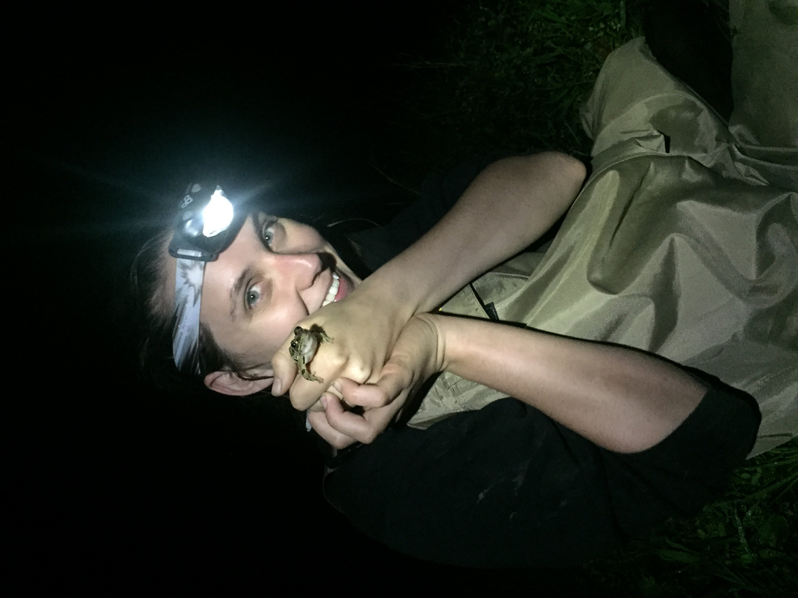

<!-- One -->
<section id="aboutmeHeader">
	

		<header class="major">
			<h2 id="aboutmeHeader">About Me</h2>
		</header>

			

I am a population and community ecologist with a broad interest in the relationships among species characteristics, the environment, and biological variation, with a conservation angle. My research within this realm pulls from a wide array of disciplines including population genetics, spatial and landscape ecology, traits-based ecology, quantitative ecology, and data science. Generally, I try to learn about a wide range of taxa and ecosystems, but I have a soft spot for freshwater - particularly anything amphibian!

Currently, I am a Postdoctoral Associate at the <a href="https://www.caryinstitute.org/">Cary Institute of Ecosystem Studies</a> working with Dr. Chris Solomon and NYSDEC biologists to quantitatively analyze the past and future of Hudson River fisheries using long-term monitoring data. Previously, I was a Postdoctoral Fellow in the <a href="https://danmag.wixsite.com/business-services">Magoulick Lab</a> in the Arkansas Cooperative Fish and Wildlife Research Unit working on flow-ecology relationships of fish and aquatic insects in the Interior Highlands region of Arkansas, Missouri, and Oklahoma. I graduated in spring 2023 with a PhD in Biological Sciences from Virginia Tech, advised by <a href="https://www.mimslab.org/">Dr. Meryl Mims</a>. For my dissertation I characterized multidimensional biodiversity in anurans of the USA.

On the life side of work-life balance, I enjoy baking (<i>from sourdough to cookies, sometimes sourdough cookies</i>), reading (<i>sci-fi or fantasy</i>), gaming (<i>board or video</i>), and exploring by running (<i>slowly</i>) and hiking.

	

</section>
<!--
-->

<!--RESEARCH-->
<section id="researchinfo">
	

		<header class="major">
			<h2 id="researchinfo">Research</h2>
			
MORE INFO COMING SOON.

