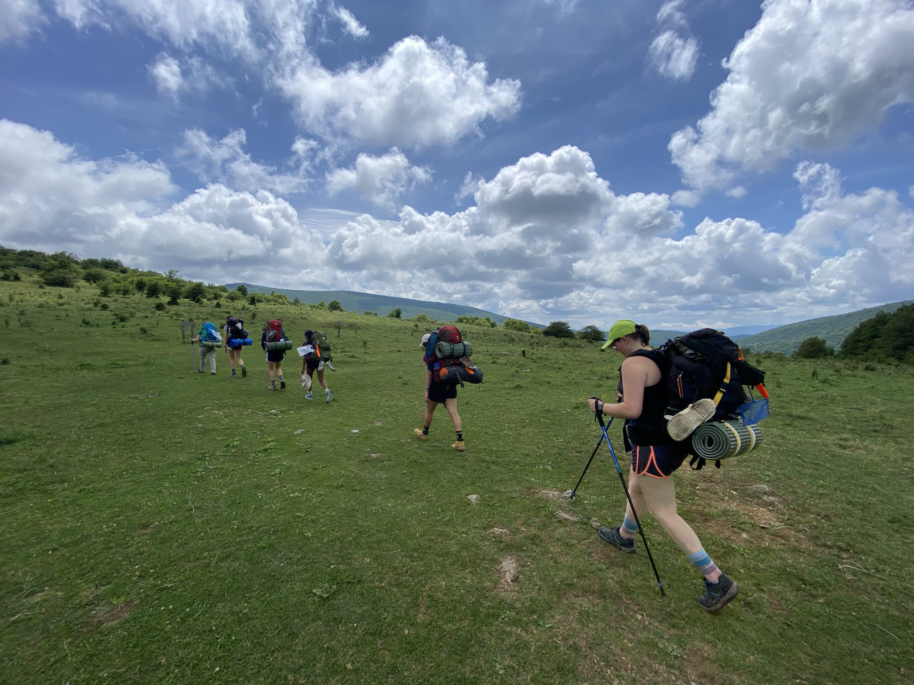

<section id="mainoutreach">
	

		<header class="major">
			<h1 id="mainoutreach">Outreach</h1>
			
I believe it is important to both create opportunities and inspiration points for young scientists and engage the public with the nature and science around them to ensure support and success of future science, conservation, and management.

		</header>
	

</section>

<!-- One -->
<section id="GALS">
	

		<header class="major">
			<h3 id="GALS">Southwest Virginia GALS</h3>
			
PAGE IN PROGRESS CHECK BACK SOON.
		
		</header>
		
	

</section>
<!--
-->

